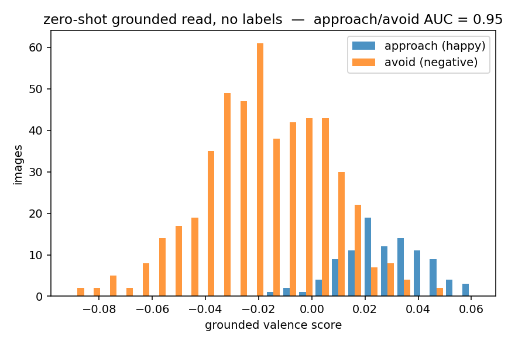

# Amygdala grounding — the one thing that's testable without a body

Most of the felt-agent thesis can't be tested below scale (see the [root README](../../README.md#the-experiments-and-the-boundary-they-hit)). **One piece can:** the amygdala's *perceptual grounding* — does a frozen CLIP representation already carry human-labelled affect, so a **linear** read separates approach from avoid on images it never trained on?

This is the **designed, known part** of the system — a net that reads perception and outputs approach/avoid. Measuring it isn't discovering whether it works; it's putting a number on the known thing so the claim is a **shipped datapoint, not only prose.**

## Result

*Dataset: [`FastJobs/Visual_Emotional_Analysis`](https://huggingface.co/datasets/FastJobs/Visual_Emotional_Analysis) — 800 human-labelled images. Approach = {happy}; avoid = {anger, contempt, disgust, fear, sad}; neutral and **surprise** dropped (surprise is affectively ambiguous — a threat-orienting/salience signal, not a clean approach). Frozen CLIP ViT-B/32, a **linear** read. Reproducible from the Hub — `python measure_grounding.py`.*

> **Zero-shot grounded read — no labels at all: approach/avoid AUC = 0.95** (vs 0.50 chance).

Text-anchoring on frozen CLIP features separates happy from negative faces it never trained on — the grounded read is right *before* any experience. A trained **linear** probe on a disjoint held-out split reaches only AUC 0.96 ± 0.01 (10 random splits) / acc 0.88 (base rate 0.83): barely above zero-shot, because the affect is already *linearly present in the frozen features* — nothing is "learned into" a head. That's the honest headline: the grounding is in the representation, readable with zero labels.



## What it does and does not show

- **Shows:** human-labelled approach/avoid is **linearly readable, zero-shot,** from frozen perceptual features on held-out images (AUC 0.95, chance 0.50) — the grounded read-out generalizes without task labels.
- **Does NOT show:** the developed value system — **the wall** — earned over lived embodied time, needs scale. This says nothing about the full agent.
- **Scope caveats (honest):** it's *facial* affect specifically (a prime amygdala stimulus, but a subset of the faces / scenes / distress / nurture the amygdala reads); the probe is a *linear* read of a general-purpose encoder, so it measures the encoder's grounding, not a trained organ; the classes are imbalanced (100/500), so read AUC, not raw accuracy.

**The one-liner to ship with the number:** *"This measures the perceptual grounding — the part that's designed and known. It says nothing about the developed value (the wall), which needs scale. Not validation; a shipped datapoint."*

## Run it

```bash
pip install torch open_clip_torch datasets numpy scikit-learn matplotlib pillow
python measure_grounding.py     # pulls the dataset from the HuggingFace Hub, runs on GPU/MPS/CPU
```
Writes `results/grounding.png` and prints the metrics.
