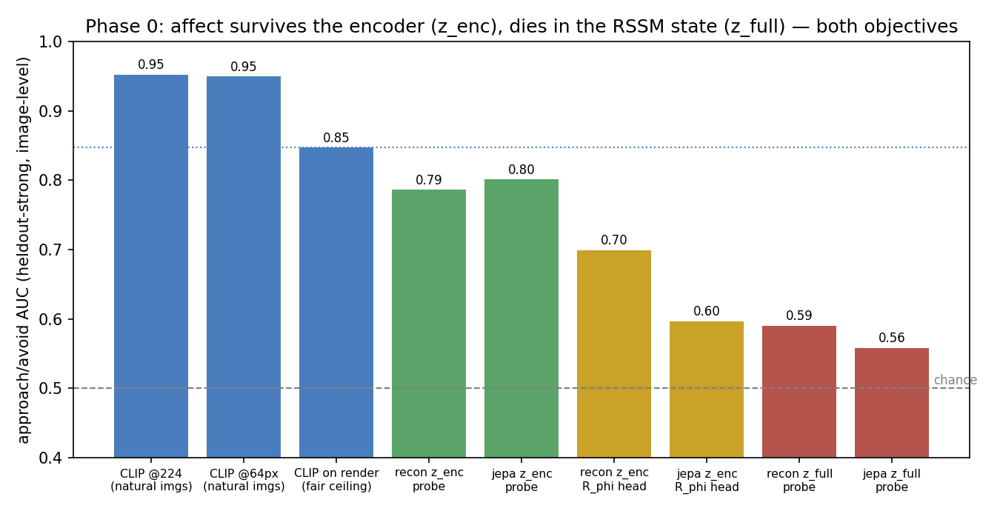

# Phase 0 — does the grounding survive the encoder swap?

The amygdala's perceptual grounding lives on frozen CLIP features
([AUC 0.95](../../amygdala_grounding/README.md)). The architecture, however, reads `R_φ` from the
learned latent `z_t` of a world model trained for *prediction* — and a prediction objective is
free to discard the appearance detail affect lives in. This experiment measures what survives the
swap. **It is a component kill-check, not a test of the thesis** — it says nothing about the
developed value (the wall).

## Method (all code in this directory, one command: `zsh run_phase0_local.sh`)

- **Gallery world** (`gallery_env.py`): numpy raycast 3D room, 64×64 egomotion pixel stream, the
  800 human-labelled affect images ([FastJobs/Visual_Emotional_Analysis](https://huggingface.co/datasets/FastJobs/Visual_Emotional_Analysis))
  as wall billboards; scripted approach-and-stare so billboards get foveated. Image-level splits:
  60% train / 20% heldout-weak (world model sees, head never) / 20% **heldout-strong (nothing ever
  sees — all numbers below)**.
- **One RSSM backbone, two objectives** (`train_wm.py`, 6M params, 12k steps, 100k frames): pixel
  **reconstruction** (Dreamer-style, latent pressured to keep appearance) vs **EMA-latent
  prediction** (V-JEPA/BYOL-style, latent free to discard it). Identical everything else, so any
  grounding gap is attributable to the objective bit alone.
- **Re-ground** (`extract_reground.py`): distill a small head from the frozen-CLIP *zero-shot*
  teacher (no human labels in training) onto `z_enc` (encoder embedding) and `z_full`
  (deter ⊕ posterior — what the architecture's `R_φ` reads). Linear probe vs human labels as the
  information-presence diagnostic. Image-level AUC, ≥15%-billboard frames, 3 head seeds.

## Results

| read (heldout-strong, n=82 images) | recon | jepa |
|---|---|---|
| CLIP zero-shot on the rendered frames (**fair ceiling**) | 0.847 | 0.847 |
| linear probe on `z_enc` | 0.786 | **0.807** |
| linear probe on `z_full` | 0.590 | 0.558 |
| distilled `R_φ` head on `z_enc` | 0.699 | 0.597 |
| distilled `R_φ` head on `z_full` | 0.651 | 0.576 |

Resolution is **not** the bottleneck (step 0): CLIP reads affect at 0.950 AUC from 64px natural
images (0.934 even at 32px) vs 0.952 at native — the signal is low-frequency. The raycast *render
domain* costs ~0.10 (ceiling 0.847).

## Findings

1. **The RSSM state is where affect dies — under both objectives.** Probes read approach/avoid
   from the encoder embedding at 0.79–0.81 (within ~0.05 of the render ceiling) but from the
   recurrent state at only 0.56–0.59, near chance. The filter compresses history for dynamics and
   discards current-frame affective content the dynamics don't need.
   **Architecture consequence: `R_φ` should tap perception pre-RSSM (`z_enc`), not the filtered
   world-state** — which is also the biological wiring (amygdala reads early sensory cortex, not a
   deliberated world model).
2. **The reconstruction-free threat did not bind at this scale.** jepa's encoder kept slightly
   *more* linear affect than recon's (0.807 vs 0.786). The feared recon-vs-JEPA gap appeared only
   downstream of distillation, not in information presence.
3. **Distillation from a noisy teacher costs ~0.1 AUC.** Heads trail their probes even when
   trained only on content-bearing frames (escalation 1, `results/phase0_reground_esc1.json` —
   no improvement), because the zero-shot teacher itself is noisy on 64px raycast renders.
   Consequence for the organ: **auto-label at full camera fidelity** (the real system's teacher
   reads the camera stream, not the world model's downsampled input) — a protocol fix, budgeted
   as the first pod-scale follow-up.

## Gate verdicts ([PLAN.md](PLAN.md))

- **G0-res: PASS** (0.950 @ 64px).
- **G0-z: FAIL on `z_full`** — as designed to detect; resolved by the pre-RSSM tap rather than
  by scale-blaming.
- **G0-diag: borderline PASS on `z_enc`** (0.79–0.81 vs 0.85 absolute; within 0.04–0.06 of the
  render ceiling).

## Honest caveats

6M-param world model, 12k gradient steps, 100k frames — a small-scale *instrument*, so "RSSM
discards affect" is established here, not at flagship scale where a larger state may keep more.
The heldout-weak split is underpowered (23 qualifying images) and not interpreted. The teacher
saw the same 64px renders the WM did — finding 3 says fix that first. Facial-affect images on
billboards are static wallpaper; a world model has no dynamics-reason to keep them (the Nursery's
distress cues are dynamic and reward-relevant — a gallery null is pessimistic, per PLAN.md).

**The one-liner:** *the grounded read survives the learned encoder (~0.05 below ceiling) and dies
in the recurrent world-state — so the amygdala taps perception, not the world model. Measured,
not assumed.*
