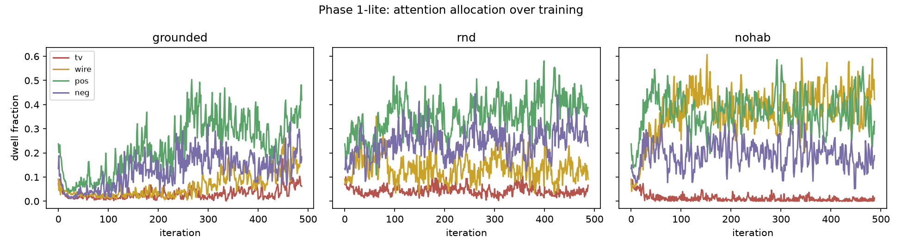

# Phase 1-lite — does the grounded objective close the loop, and does it diverge from novelty?

Phase 0 measured `R_φ`'s grounding as a *read-out*. Phase 1-lite is the first test with the
**full loop live**: reward model → RL → behavior. It runs in the gallery world with two added
divergence constructs and asks two questions:

1. **(differentiator)** does a grounded agent allocate attention differently from a tuned novelty
   (RND) agent — ignore a content-free noisy TV, prefer grounded-positive content?
2. **(anti-wireheading)** does habituation-as-RPE-decay stop the agent fixating on a predictable
   reward source, where the no-habituation ablation cannot?

**This is a mechanism demo at toy scale, not a test of the thesis.** The thesis's own Problem 1
states the differentiator *provably cannot* be shown below large scale. Read accordingly.

## Setup

> **Prerequisite:** run [Phase 0](../phase0/) first (`../phase0/run_phase0_local.sh`). This phase
> loads the Phase 0 world-model checkpoint (`../phase0/ckpt/wm_recon.pt`) and its data pools,
> which are git-ignored — they must be produced locally before `run_phase1_lite.sh` will run.

- **Gallery + constructs** (`env_constructs.py`): the Phase 0 raycast gallery, plus a **noisy TV**
  (billboard of fresh uniform noise every frame — max novelty, zero grounded content) and a
  **wirehead** (the same grounded-positive image at a fixed wall spot forever — perfectly
  predictable good). Affect billboards balanced pos/neg, resampled every 800 steps.
- **Frozen Phase 0 encoder** → 256-d `z_enc` (Phase 0's finding: affect lives here, not in the
  RSSM). PPO on `[z_enc, prev_action]`, identical across conditions.
- **Reward** (`train_agent.py`): `grounded` = `relu(R_φ) − P(z) + min(R_φ,0)` (appetitive
  habituates via online predictor `P`; aversive floor never predicted away) · `nohab` = raw `R_φ`
  · `rnd` = tuned random-network-distillation novelty. `R_φ` = head distilled from a frozen-CLIP
  zero-shot teacher, self-calibrated to the agent's content-free frames (no human labels).
- 3 conditions × 3 seeds × 2M steps, one RTX 4090, ~1.5 h. Greedy eval on fresh galleries,
  3 policy seeds × 3 env seeds.

## Results

Greedy-eval dwell fraction (mean ± std):

| | grounded | rnd | nohab |
|---|---|---|---|
| wirehead | 0.10 ± .08 | 0.02 | **0.28 ± .08** |
| noisy TV | 0.04 | 0.07 | 0.02 |
| positive | 0.23 | **0.41** | 0.50 |
| negative | 0.20 | 0.15 | 0.15 |
| nothing | 0.42 | 0.35 | **0.05** |

## Findings — one positive, two honest nulls

1. **Habituation prevents wireheading (CLEAN, ablation-verified).** The no-habituation ablation
   parks on the predictable dispenser — 28% dwell in eval, rising 0.30→0.42 over training — and is
   almost never idle (5% "nothing"). The grounded agent, *same reward model* plus the RPE-decay
   channel, holds wirehead dwell to 10% and stays free to roam. Removing exactly one mechanism
   produces exactly the pathology it exists to prevent. **This is the result that survives.**

2. **The noisy-TV divergence did NOT appear (NULL).** RND spent only 7% on the TV — it never
   fixated, so grounded ≈ RND here. Our initial diagnosis blamed the *frozen encoder* (fresh
   uniform noise maps to a low-variance latent region the RND predictor fits easily, laundering
   the noise out of the novelty signal). **Phase 1.5 below tested that diagnosis and it FAILED**
   — pixel-space RND doesn't fixate either. The null is about the construct, not the shortcut:
   a billboard-sized noise patch cannot dominate prediction error against a room full of varied
   imagery. The TV trap itself needs rebuilding before the divergence claim is testable here.

3. **Grounded did NOT beat novelty on valence-directed behavior (NULL / MIXED).** The grounded
   agent approached positives *less* than RND (0.23 vs 0.41) and dwelt on negatives slightly
   *more* (0.20 vs 0.15) — no clean approach/avoid asymmetry. Two traceable causes: habituation
   flattens the appetitive pull, leaving the grounded agent a restless wanderer (42% idle); and,
   tying back to Phase 0, **`R_φ` distilled on `z_enc` is a noisy ~0.6–0.7 signal** — too weak
   per-frame to steer fine avoidance, and the aversive weight (`w_c=1`) too low to compensate.

## What it proves

The grounded reward model closes the full RL loop and the **anti-wirehead mechanism works, verified
by its own ablation.** The **grounded-vs-novelty differentiator did not materialize at this scale**
— which is what Problem 1 predicts, not a surprise. Net: a small-scale confirmation of the
thesis's *boundary condition*, plus three concrete, earned levers for the next rung:

- **don't freeze the backbone** — the frozen encoder both defangs the TV trap and caps `R_φ`
  quality; the architecture already specifies a plastic backbone.
- **strengthen the aversive channel** — clean up grounding (Phase 0 finding #3: full-fidelity
  teacher) and raise `w_c`; the appetitive/aversive imbalance is measured here, not guessed.
- **scale the world** — "meaningful ≠ novel" only bites when the world is rich enough that a
  content-free drive and a grounded one point different ways; the gallery is not.

## Honest caveats

Frozen 6M encoder + linear-ish reward head, 2M steps, one toy world — an *instrument*, not the
system. The wirehead result is clean and (per Phase 1.5) survives an unfrozen backbone. The TV
null is robust — we tested our own excuse and it failed (Phase 1.5). `side_by_side.gif` shows
grounded vs RND greedy behavior — illustrative, not evidence. The number that matters is the
ablation contrast in finding 1.

---

# Phase 1.5 — the encoder-unfreeze check (is the null the shortcut or the idea?)

We tested our own diagnosis. Four pre-registered conditions (predictions written in
`run_phase15_pod.sh` **before** running; 3 seeds × 2M steps each, ~6 h on the same 4090, ~$4;
reward source held constant on the frozen encoder in the grounded arms so encoder plasticity is
the only manipulated variable per arm):

| condition | what changed | prediction | eval result (greedy, mean±std) | verdict |
|---|---|---|---|---|
| `rnd_pixrnd` | ONLY RND's input → raw pixels | TV ≫ 7%; >2× confirms laundering | TV **11.6% ± 5.1** (1.7×) | **MISS** — below threshold, no fixation |
| `rnd_pix` | canonical RND: plastic pixel policy + pixel RND | TV fixation | TV **5.9% ± 6.9** | **FAIL** — identical to frozen null |
| `grounded_pix` | plastic pixel policy, reward unchanged | TV low; wirehead still habituates | TV 7.3%, wire **4.5%** | **PASS** |
| `nohab_pix` | plastic policy, raw `R_φ` | wirehead fixation persists | wire **13.3% ± 7.2** = 3.0× grounded_pix | **PASS** |

**Findings:**

1. **The laundering diagnosis was WRONG.** Moving RND to pixel space nudges TV dwell up (7→12%)
   but nowhere near fixation, and the canonical pixel-RND agent ignores the TV entirely. The
   noisy-TV null is **robust to the encoder** — the construct is the problem: a billboard-sized
   noise patch can't dominate pixel prediction error against a gallery of diverse faces. The
   classic noisy-TV trap needs a bigger, richer trap (full-wall TV / structured novel content)
   before the grounded-vs-novelty contrast is testable in this world.
2. **The anti-wirehead result survives plasticity.** With a fully learning pixel backbone, the
   no-habituation agent still parks on the predictable dispenser at 3× the habituated agent's
   rate — the Phase 1-lite headline replicates under the architecture-faithful condition.
3. **Confound worth naming:** all plastic-policy arms idle more (~50% "none" vs 27% for the
   frozen-feature arm) — 2M steps from pixels is undertrained relative to 2M steps from frozen
   features, so absolute dwell levels shrink; the *ratios* (finding 2) are the comparable
   quantity.

**Revised one-liner:** *habituation stops wireheading — ablation-proven, and it survives an
unfrozen backbone; the noisy-TV null is real, not a frozen-encoder artifact (we tested our own
excuse and it failed): the trap, not the agent, needs rebuilding. Measured, including where our
first explanation was wrong.*
